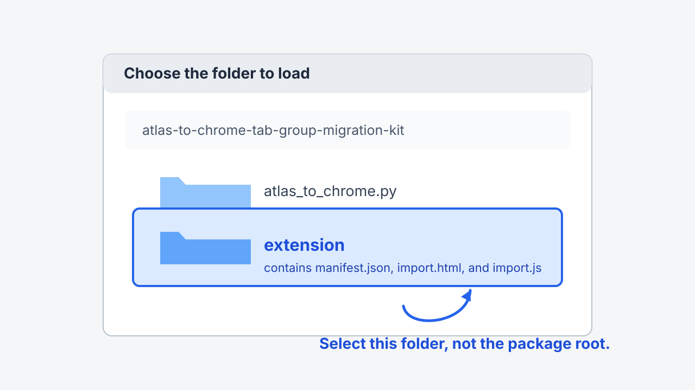
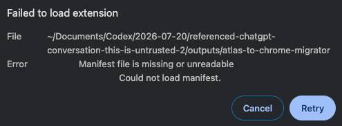
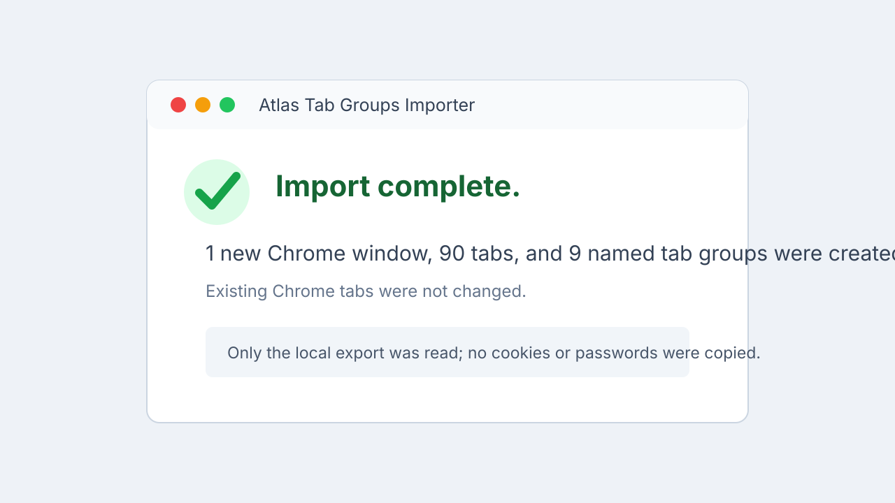

# Atlas → Google Chrome tab-group migration kit

This self-contained macOS kit exports the persistent tab-group configuration from ChatGPT Atlas and recreates it as **new Chrome windows**. It is meant to be kept as one folder and reused whenever you need to migrate an Atlas workspace.

It preserves the information that defines a working tab-group layout:

| Atlas information | Chrome result |
| --- | --- |
| Window membership | One new Chrome window per Atlas workspace window |
| Tab order | Preserved within each new window |
| Pinned tabs | Preserved and kept leftmost |
| Group names | Preserved exactly |
| Group membership | Preserved from Atlas’s saved contiguous group ranges |
| Collapsed groups | Preserved where Chrome supports it |
| Group colors | Stable Chrome colors assigned from the Atlas group title/symbol |

It does **not** copy browser sessions or credentials. In particular, it never copies cookies, passwords, saved payment details, History, local storage, Chrome profile databases, Atlas/Chrome `Sessions` files, or raw Atlas interaction-state blobs.

## Package contents

```text
atlas-to-chrome-tab-group-migration-kit/
├── README.md                     # this guide
├── atlas_to_chrome.py            # exporter, backup writer, and local launcher
├── extension/                    # local one-time Chrome importer
│   ├── manifest.json
│   ├── import.html
│   └── import.js
└── screenshots/
    ├── 01-wrong-folder-selected.png
    ├── 02-select-extension-folder.svg
    ├── 03-success-report.svg
    └── README.md
```

Keep `atlas_to_chrome.py` beside the `extension/` directory. The script checks that the extension has the expected identity before it opens it.

## Before you begin

You need:

1. macOS with ChatGPT Atlas data still present at `~/Library/Application Support/com.openai.atlas`.
2. Google Chrome installed in `/Applications`.
3. Python 3 (included with most macOS developer setups).
4. Enough Chrome access to install one local unpacked extension. This is a one-time, per-Chrome-profile setup.

Open Terminal, change into this folder, and make the script executable if the file lost its executable bit during transfer:

```bash
cd /absolute/path/to/atlas-to-chrome-tab-group-migration-kit
chmod +x atlas_to_chrome.py
```

> **Privacy note:** the JSON export contains the URLs and group names needed to recreate your workspace. Treat each run folder as private.

## Step 1 — find the target Chrome profile

Most people use `Default`. Check rather than guess if you use multiple Chrome profiles:

```bash
python3 atlas_to_chrome.py profiles
```

Use the directory name printed by that command in later commands, for example `Default` or `Profile 2`.

## Step 2 — install the local importer once

Chrome deliberately prevents scripts from silently loading unpacked extensions into a normal profile. The one required manual action is installing the local helper through Chrome’s own Extensions page.

1. Close Google Chrome normally. The script never force-quits it.
2. Run:

   ```bash
   python3 atlas_to_chrome.py install --chrome-profile Default
   ```

3. Chrome opens **Extensions** and Finder opens this kit’s `extension/` directory.
4. In Chrome’s Extensions page, switch on **Developer mode**.
5. Select **Load unpacked**.
6. Choose the **`extension` folder itself** — the folder containing `manifest.json`.
7. Confirm that **Atlas Tab Groups Importer** appears.



The extension has only the permissions needed to create Chrome tabs and tab groups and to receive the one-time migration payload from `127.0.0.1`. It is inert unless the script opens it with a newly generated one-time token.

### If Chrome says “Manifest file is missing or unreadable”

You selected the package root rather than its `extension/` subfolder. Press **Cancel**, choose **Load unpacked** again, and select the folder shown by the arrow in the visual above.



That error is harmless: Chrome has not imported, copied, or changed any tabs.

## Step 3 — inspect Atlas without changing anything

Atlas’s normal export is deliberately fail-closed while Atlas is open, so that a saved configuration cannot be read halfway through a change. Close Atlas normally, then run:

```bash
python3 atlas_to_chrome.py inspect
python3 atlas_to_chrome.py export --dry-run
```

The commands report only counts, such as windows, tabs, pinned tabs, named groups, and skipped/adjusted URLs. They do not print your URLs or group names.

If you intentionally need a best-effort read while Atlas is open, add `--allow-live-atlas`. Use it only when a normal Atlas shutdown is not practical:

```bash
python3 atlas_to_chrome.py inspect --allow-live-atlas
```

## Step 4 — choose an execution route

### Route A: normal full migration

Use this for the cleanest migration. Close Atlas and Chrome normally, then run:

```bash
python3 atlas_to_chrome.py migrate \
  --output-dir "$HOME/Desktop/atlas-to-chrome-$(date +%Y%m%d-%H%M%S)" \
  --chrome-profile Default \
  --apply
```

The script writes a private export and backup, starts Chrome in the requested profile, opens the already-installed local importer, and creates only new Chrome windows.

### Route B: keep existing Chrome windows open

Use this only after the helper extension is installed in the Chrome profile that is already open:

```bash
python3 atlas_to_chrome.py migrate \
  --allow-live-atlas \
  --output-dir "$HOME/Desktop/atlas-to-chrome-$(date +%Y%m%d-%H%M%S)" \
  --chrome-profile Default \
  --use-running-chrome \
  --apply
```

`--use-running-chrome` never closes or restarts Chrome. It opens the one-time local importer in the profile that is already running and adds new windows only.

### Route C: export first, then import after review

Use this when you want to examine the export before creating Chrome tabs:

```bash
# Create the private source-only export and backup.
python3 atlas_to_chrome.py export \
  --output-dir "$HOME/Desktop/atlas-to-chrome-$(date +%Y%m%d-%H%M%S)"

# Confirm exactly what would be recreated. This starts no browser.
python3 atlas_to_chrome.py import \
  --export-file /absolute/path/to/atlas-tab-groups.json \
  --chrome-profile Default \
  --dry-run

# Create the new Chrome windows only after the dry run succeeds.
python3 atlas_to_chrome.py import \
  --export-file /absolute/path/to/atlas-tab-groups.json \
  --chrome-profile Default \
  --apply
```

### Route D: isolated rehearsal

This creates an empty Chrome data directory for a practice import. It does not clone your normal Chrome profile or its sign-ins:

```bash
python3 atlas_to_chrome.py install \
  --chrome-user-data-dir "$HOME/Desktop/atlas-chrome-practice-profile"

# Complete the same one-time “Load unpacked” step in the practice profile,
# quit that practice Chrome, then import into it.
python3 atlas_to_chrome.py import \
  --export-file /absolute/path/to/atlas-tab-groups.json \
  --chrome-user-data-dir "$HOME/Desktop/atlas-chrome-practice-profile" \
  --apply
```

## Step 5 — read the completion report and verify Chrome

The local importer page and the terminal print counts only. A successful report resembles this:



Then verify the result in Chrome:

1. Locate the new Chrome window(s). Existing windows are not edited.
2. Check that each named group label is present.
3. Check that the group colors are distinct and the expected groups are collapsed/expanded as intended.
4. Check a few representative tabs within each group. A website may redirect after it loads; that normal navigation does not mean Chrome changed the imported group layout.
5. Confirm that pinned tabs, if any, appear at the far left of the new window.

For a log-only confirmation, open the run folder’s `chrome-import-YYYYMMDD-HHMMSS.log`. It contains the created window/tab/group counts but never URLs or group names.

## What each run writes

Each real export creates a private run directory (`0700`) and private JSON files (`0600`):

```text
atlas-to-chrome-YYYYMMDD-HHMMSS/
├── atlas-tab-groups.json              # URLs + migration topology
├── migration.log                      # operational counts only
├── chrome-import-YYYYMMDD-HHMMSS.log  # import counts only
└── backup/
    ├── atlas-tab-groups.json          # private duplicate of the export
    └── source-record-manifest.json    # source checksums; no source contents
```

The script does not copy raw Atlas records. The manifest lets you confirm which application-owned Atlas records were read without retaining their contents.

## Recovery and cleanup

- **Undo an import:** close the newly created Chrome window(s). Existing Chrome tabs are unaffected.
- **Keep Atlas until you are satisfied:** Atlas is never changed by this kit.
- **Remove the helper after success:** open `chrome://extensions`, find **Atlas Tab Groups Importer**, and choose **Remove**. The imported tabs and groups remain.
- **Protect or delete old run folders:** they contain private URLs and group names. The script never deletes them automatically.

## Troubleshooting

| Symptom | What to do |
| --- | --- |
| Atlas is still running | Close it normally, or use `--allow-live-atlas` only for a best-effort read. |
| Chrome says the manifest is missing | Select `extension/`, not the package root. See the screenshot above. |
| Google Chrome is still running | Close it normally, or use `--use-running-chrome` after installing the helper in that same open profile. |
| Chrome profile was not found | Run `python3 atlas_to_chrome.py profiles`, then pass the printed name with `--chrome-profile`. |
| The importer times out | Look at the visible local importer page before retrying. A failed run may have created partial **new** windows, but it never changes existing tabs or copies credentials. |
| A URL is absent | Only `http`, `https`, and `about:blank` are importable. Internal/non-web URLs are safely skipped and included only in the count. |

## Reuse notes

This kit is intentionally portable as a folder, but each run is local to the Mac on which Atlas stored the source configuration. Do not put a real run folder or `atlas-tab-groups.json` into version control or a public archive.

For a new migration, keep the kit intact, repeat the one-time Chrome helper installation only if you use a different Chrome profile, and create a fresh output folder for every run.
